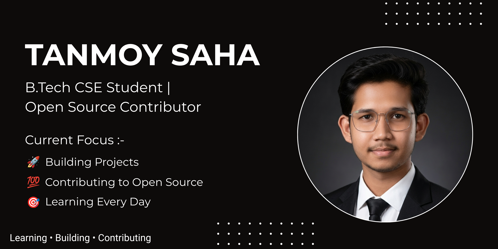
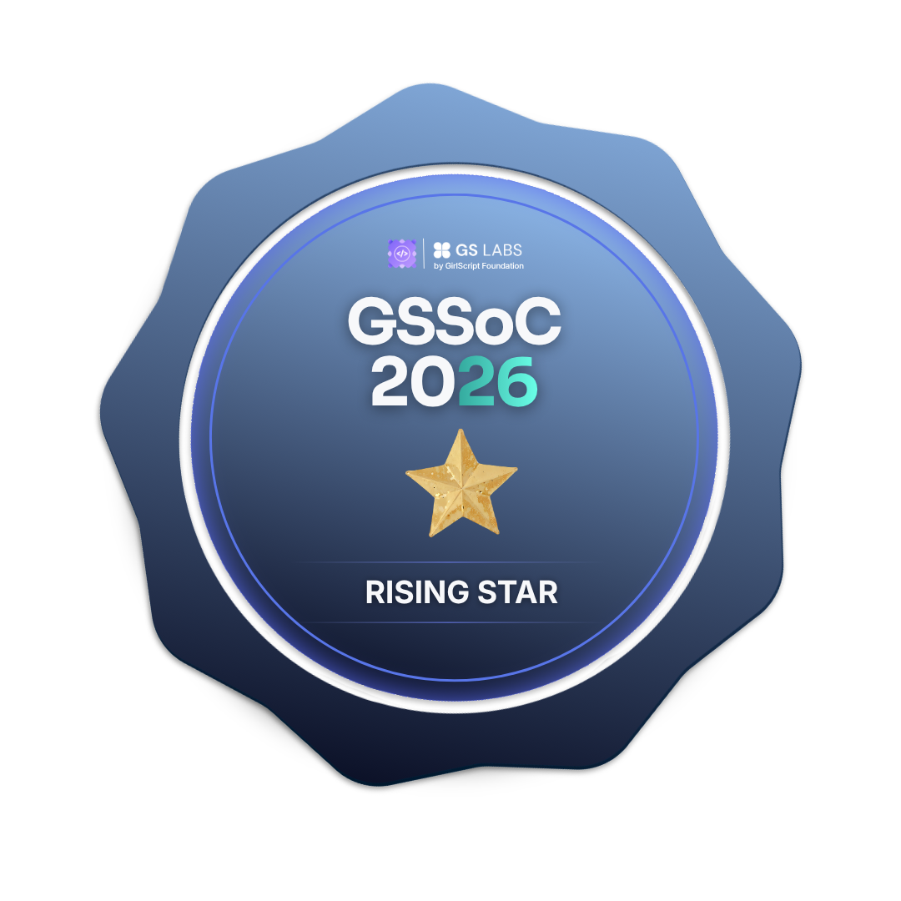
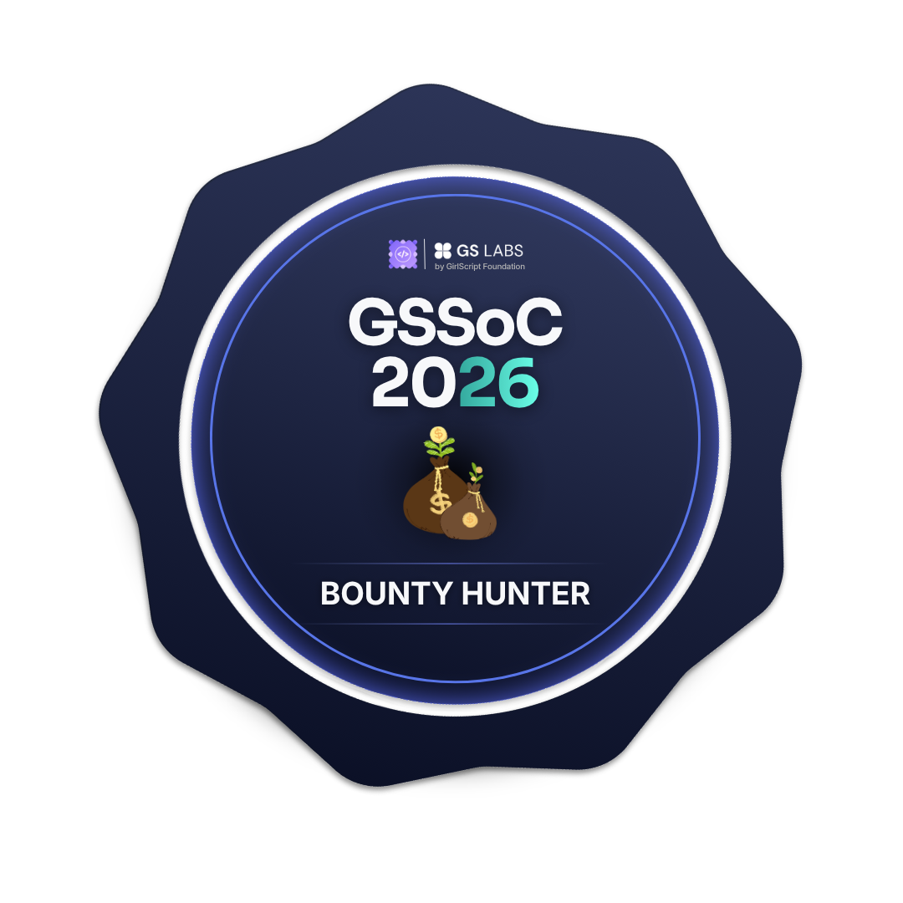

  

<h1 align="center">Hi 👋, I'm Tanmoy Saha</h1>

  

  

  
  
  

## 🚀 About Me

Name: Tanmoy Saha
Education: B.Tech CSE @ Sharda University
Focus: Open Source + Full Stack Development
Current Challenge: 100 Days 100 Web Projects
Learning: Java, DSA, React, Next.js
Goal: Google Summer of Code (GSoC)

I believe the best way to learn software engineering is by building real projects, contributing to open source, and shipping consistently.

## 🔥 Current Focus

* 🌍 Open Source Contributions
* 🏆 GSSoC 2026
* 💯 100 Days 100 Web Projects
* ☕ Java & DSA
* 🌐 Full Stack Development
* 🚀 Building a strong developer portfolio

⸻

## 🛠️ Tech Stack

Languages

Frontend

Tools

## 🌍 Open Source Journey

Currently contributing to projects like:

* SkillBridge
* Cubasapiens
* NeoTetris Premium Edition

Learning:

* Git Workflows
* Pull Requests
* Code Reviews
* Team Collaboration
* Large Codebases

## 💯 100 Days 100 Web Projects

A challenge to build consistently, improve problem-solving skills, and create a strong portfolio through hands-on development.

Goals

* Learn by Building
* Improve Frontend Skills
* Build Publicly
* Strengthen Development Fundamentals
* Create Production-Ready Projects

⸻

## 🚀 Featured Projects

🎮 NeoTetris Premium Edition

Modern browser-based Tetris experience.

📊 GitHub Profile Analyzer

Analyze GitHub profiles with useful insights and statistics.

⏱️ FocusSprint

Productivity-focused web application.

🍲 FoodShare

Community-driven food sharing platform.

⸻

## 📊 GitHub Stats

  
  

  

## 🏆 GitHub Trophies

  

## 📈 Contribution Graph

  

## 🏅 GSSoC'26 Badges

  
  
  

  
  
  

  

## 🎯 2026 Roadmap

* Start Open Source Contributions
* Join GSSoC
* Complete 100 Days 100 Web Projects
* Reach 500+ GitHub Contributions
* Build Multiple Production-Level Projects
* Crack GSoC

⸻

## 📫 Connect With Me

📧 tanmoysaha092006@gmail.com

💼 LinkedIn:
https://www.linkedin.com/in/tanmoy-saha-3476b038a/

🐙 GitHub:
https://github.com/Tanmoysahacodes

  <i>"Small improvements every day compound into extraordinary results."</i>
</p
